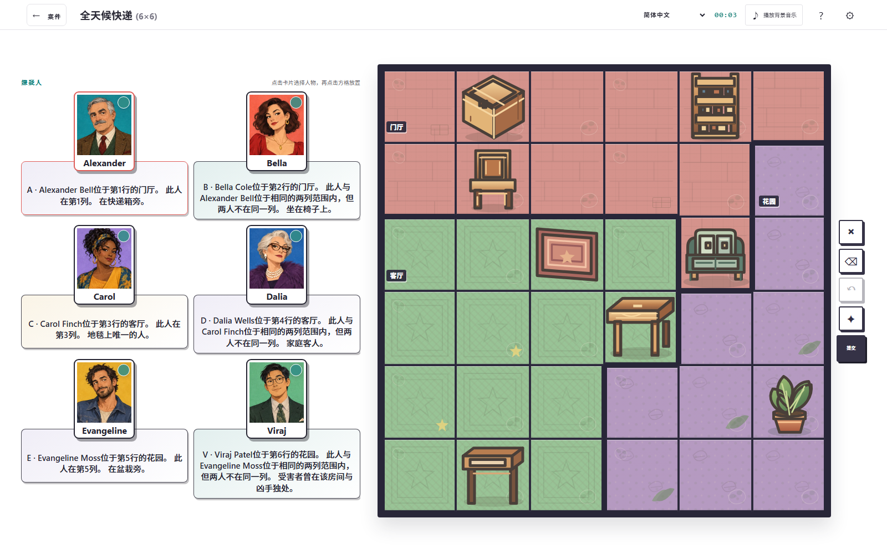
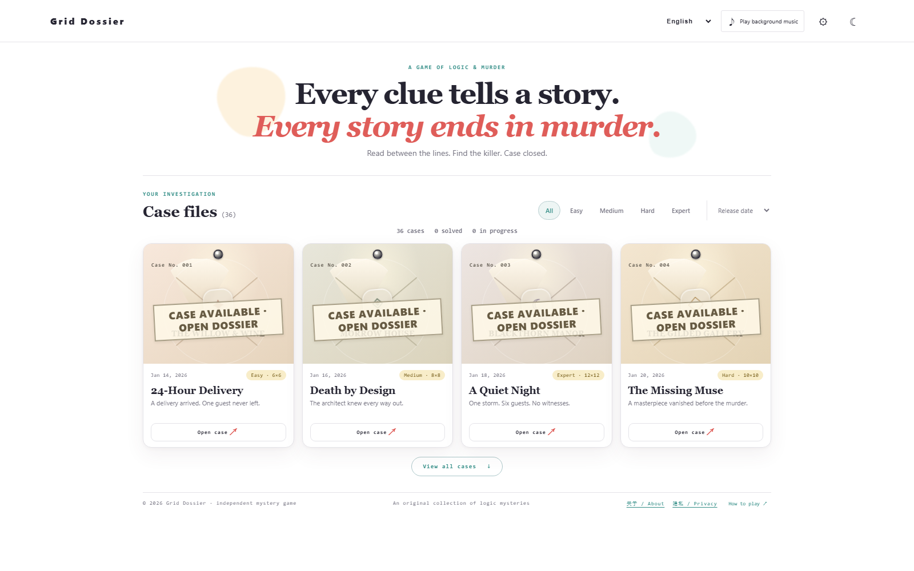
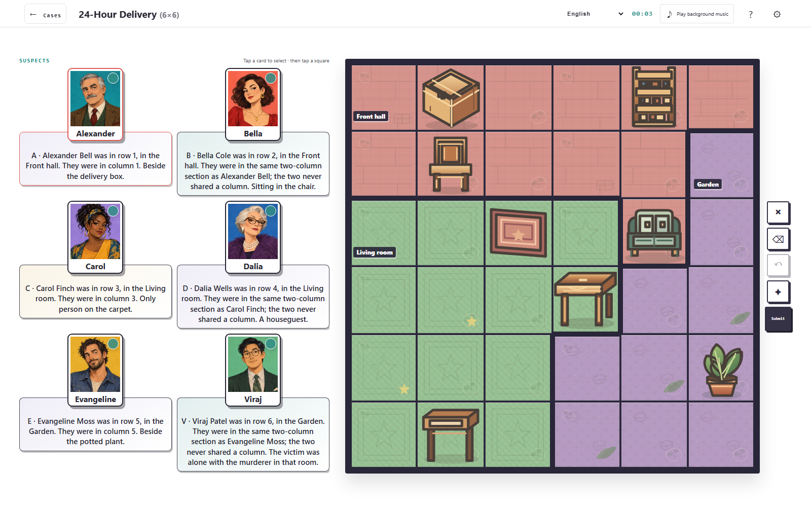

# 谜格档案｜逻辑推理游戏

[在线游玩](https://xiaoeyouxul.github.io/grid-dossier/) · [隐私政策](./privacy.html) · [关于与联系](./about.html)

谜格档案（Grid Dossier）是一款在浏览器中游玩的逻辑推理游戏。阅读嫌疑人的线索，将人物放入地图上的正确位置，推理谁与受害者身处同一房间。游戏包含 36 个案件，按简单、中等、困难和专家分级；案件的地图、人物与房间布局会随难度变化。每个案件均经过唯一解检查。

## 游戏截图

以下截图由当前项目版本生成，展示简体中文界面。

案件档案：


案件地图与人物线索：



## 功能


- 阅读人物线索并在地图格子中安排嫌疑人，推理受害者所在房间。
- 可选择人物卡片后放置到地图，或启用叉号标记不可能的位置；提供撤销、清空、提示与提交答案。
- 提供案件说明、计时、案件进度和已完成状态；进度保存在当前浏览器中。
- 提供简单、中等、困难、专家四档难度。高难度案件包含更多人物、更大的棋盘和更复杂的不规则房间。
- 支持英语、法语、西班牙语、阿拉伯语、俄语、简体中文和繁体中文；阿拉伯语界面从右向左排列。
- 支持浅色与深色外观、可选背景音乐，以及适配桌面和窄屏的布局。
- 浏览器的返回与前进按钮可用于切换案件和案件列表。

## 本地运行

安装 [Node.js](https://nodejs.org/)，在项目目录运行：

```powershell
npm run serve
```

保持终端窗口运行，并打开 <http://127.0.0.1:4173/>。这是静态网站，无需前端框架或打包步骤。运行 `node --test test/puzzles.test.js test/i18n.test.js` 可检查谜题解与界面翻译。

游戏进度保存在当前浏览器的 `localStorage`，不会同步到其他设备。网站目前没有接入 Google AdSense，也不展示广告；GitHub Pages 子域名是否符合 Google 的网站资格要求，取决于 Google 当前规则与审核结果，本项目尚未获批，也不保证获批。

## 免责声明

本项目是独立的非官方致敬作品，与 [Murdoku 原网站](https://murdoku.com/)及其作者没有关联、授权或背书关系。Murdoku 名称与原网站视觉素材归各自权利人所有；本项目的谜题和地图装饰为独立制作。权利人如对项目内容有疑问，可通过本仓库的 Issues 联系维护者。

---

# Grid Dossier | Logic deduction game

[Play online](https://xiaoeyouxul.github.io/grid-dossier/) · [Privacy Policy](./privacy.html) · [About and Contact](./about.html)

Grid Dossier is a browser-based logic deduction game. Read the suspects' clues, place them in the right map cells, and work out who shared a room with the victim. The game contains 36 cases across Easy, Medium, Hard, and Expert difficulties. Boards, casts, and room layouts change with the difficulty, and every case is checked for a unique solution.

## Screenshots

These captures were generated from the current project version in English.

Case files:



Case map and suspect clues:



## Features


- Read suspect clues and place people on the map to deduce which room contains the victim.
- Select a suspect card and place that person on a cell, or mark impossible positions with X mode. Undo, clear, hints, and answer checking are available.
- Case instructions, a timer, case progress, and solved status. Progress is saved in the current browser.
- Four difficulty levels: Easy, Medium, Hard, and Expert. Higher difficulties use larger boards, more suspects, and more complex irregular rooms.
- English, French, Spanish, Arabic, Russian, Simplified Chinese, and Traditional Chinese. Arabic uses a right-to-left layout.
- Light and dark themes, optional background music, and layouts for desktop and narrow screens.
- Browser Back and Forward navigation between cases and the case list.

## Run locally

Install [Node.js](https://nodejs.org/), then run this command in the project folder:

```powershell
npm run serve
```

Keep the terminal open and visit <http://127.0.0.1:4173/>. The site is static and needs no frontend framework or build step. Run `node --test test/puzzles.test.js test/i18n.test.js` to check the puzzle solutions and interface translations.

Progress is stored in the current browser's `localStorage` and does not sync across devices. Google AdSense is not integrated, and the site currently displays no ads. Whether a GitHub Pages subdomain qualifies depends on Google's current requirements and review. This project has not been approved and approval is not guaranteed.

## Disclaimer

This is an independent, unofficial fan project. It is not affiliated with, authorized by, or endorsed by [the original Murdoku website](https://murdoku.com/) or its creator. The Murdoku name and the original site's visual assets belong to their respective owners; this project's puzzles and map artwork are independently created. Rights holders may contact the maintainers through this repository's Issues.
