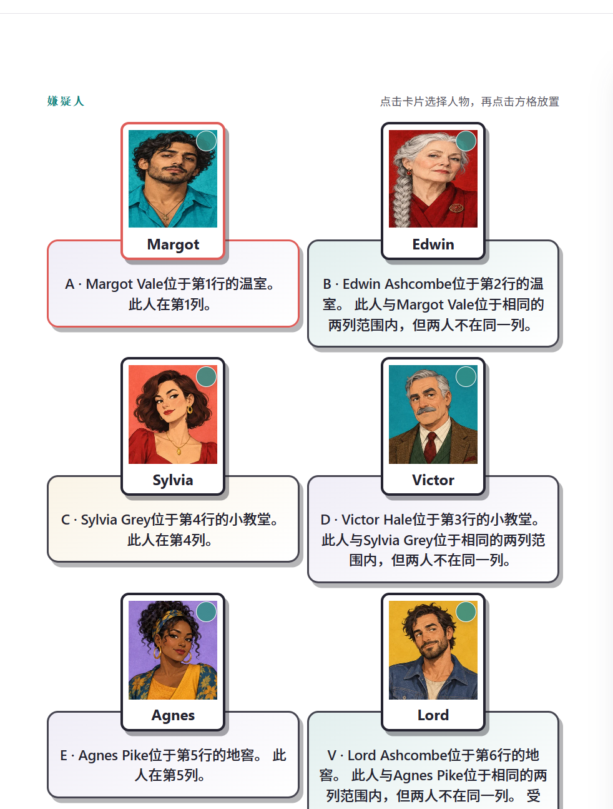
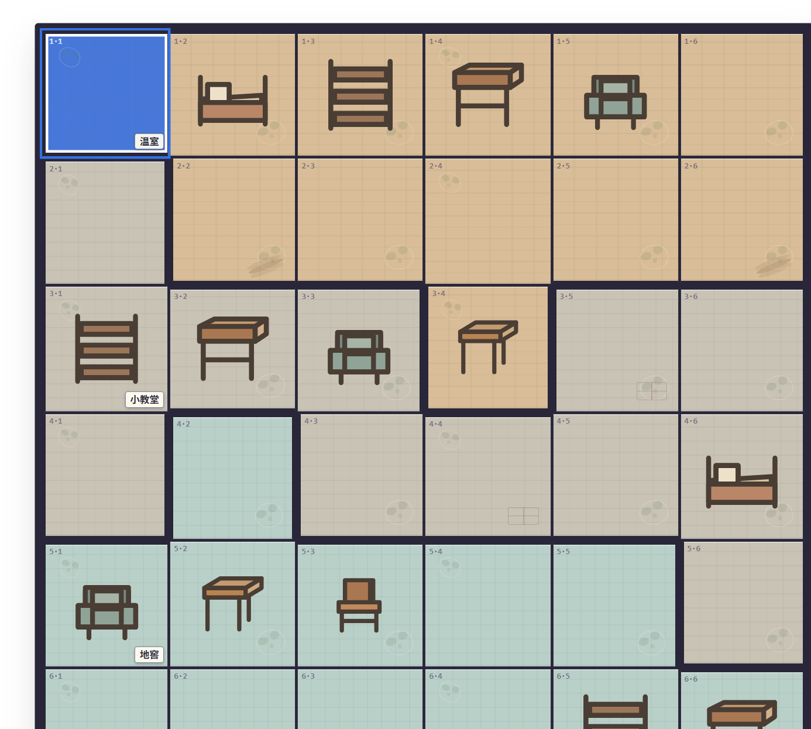

# 谜格档案｜逻辑推理案件游戏

谜格档案（Grid Dossier）是一款可直接在浏览器游玩的独立逻辑推理游戏。阅读人物线索，把嫌疑人放入地图上的正确位置，找出与受害者同处一室的人。项目包含 **36 个案件**，案件日期均设定在 2026 年，提供简单、中等、困难、专家四档难度；难度越高，人物、地图格数与房间数量越多。每个案件都经过唯一解检查。

**在线游玩：** [谜格档案在线版](https://xiaoeyouxul.github.io/murdoku-inspired/)

人物卡片与线索的布局（开发截图）：



地图格子与房间边界（开发截图；最新效果请打开在线网站）：



## 功能

- 不同难度采用不同尺寸的地图、人物数量与不规则房间。同一张地图混合横向和纵向分区，较难案件还会出现凹形、局部包绕的房间。家具、植物及地面纹理采用本站重新绘制的矢量图形。
- 选择人物后点击地图格子放置；可标记不可能的位置、撤销、清空、获取提示并提交答案。
- 进入案件时显示玩法说明；计时、案件进度和已完成状态保存在浏览器本地。浏览器返回与前进按钮可切换案件和档案页。
- 支持英语、法语、西班牙语、阿拉伯语、俄语、简体中文和繁体中文。阿拉伯语界面支持从右向左排版。
- 支持浅色／深色外观及可开关的背景音乐；桌面布局可在同一视口中展示完整地图，窄屏幕会自动调整排版。

## 本地运行

安装 [Node.js](https://nodejs.org/) 后，在项目文件夹运行：

```powershell
npm run serve
```

保持终端窗口打开，然后访问 <http://127.0.0.1:4173/>。本地网址只有在服务运行时才会打开；公开网址无需本地服务。运行 `node --test test/puzzles.test.js test/i18n.test.js` 可检查谜题解与翻译。

项目不依赖前端框架或打包步骤，静态文件由 GitHub Pages 发布。游戏进度保存在当前浏览器的 `localStorage`，不会同步到其他设备。

## 免责声明

本项目是独立的非官方致敬作品，与 [Murdoku 原网站](https://murdoku.com/)及其作者没有关联、授权或背书关系。**Murdoku** 名称与原网站的视觉素材归各自权利人所有；本项目的谜题、地图装饰和家具矢量图为独立制作，没有直接使用原网站截图或裁切素材。若权利人对项目内容有疑问，请通过本仓库的 Issues 联系维护者。

---

# Grid Dossier | Logic mystery game

Grid Dossier is an independent browser game built around deduction. Read each suspect's clue, place them on the map, and discover who shared a room with the victim. It includes **36 cases set in 2026** across Easy, Medium, Hard, and Expert difficulties. Higher tiers increase the cast, board size, and number of irregular rooms. Every case is checked for a unique solution.

**Play online:** [Grid Dossier online](https://xiaoeyouxul.github.io/murdoku-inspired/)

Suspect cards and clues (development capture):


Map cells and room boundaries (development capture; open the live site for the latest artwork):


## Features

- Difficulty-specific boards and cast sizes. Each map mixes horizontal and vertical rooms; harder cases add concave or partially enclosing shapes. Furniture and floor details use original vector artwork.
- Suspect placement, impossible-cell marks, undo, clear, hints, and answer checking.
- A tutorial when opening a case, a timer, locally saved progress, and browser Back/Forward navigation.
- English, French, Spanish, Arabic, Russian, Simplified Chinese, and Traditional Chinese; Arabic uses right-to-left layout.
- Light/dark appearance, optional background music, and a desktop layout that fits the full board in the viewport.

## Run locally

Install [Node.js](https://nodejs.org/), run `npm run serve` in this folder, and keep the terminal open. Visit <http://127.0.0.1:4173/>. The public site does not require a local server. Run `node --test test/puzzles.test.js test/i18n.test.js` to validate puzzles and translations.

This is a static, dependency-free site published with GitHub Pages. Progress is stored in the current browser's `localStorage` and does not sync across devices.

## Disclaimer

This is an independent, unofficial fan project. It is not affiliated with, authorized by, or endorsed by [the original Murdoku website](https://murdoku.com/) or its creator. The Murdoku name and the original site's visual assets belong to their respective owners. This project uses independently created puzzles and vector map artwork, not screenshots or cropped assets from the original site. Rights holders may contact the maintainers through this repository's Issues.
